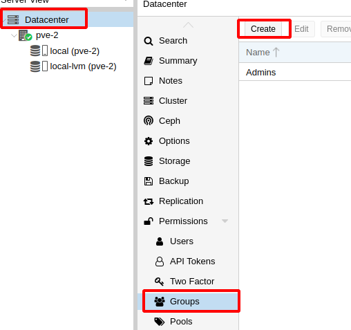
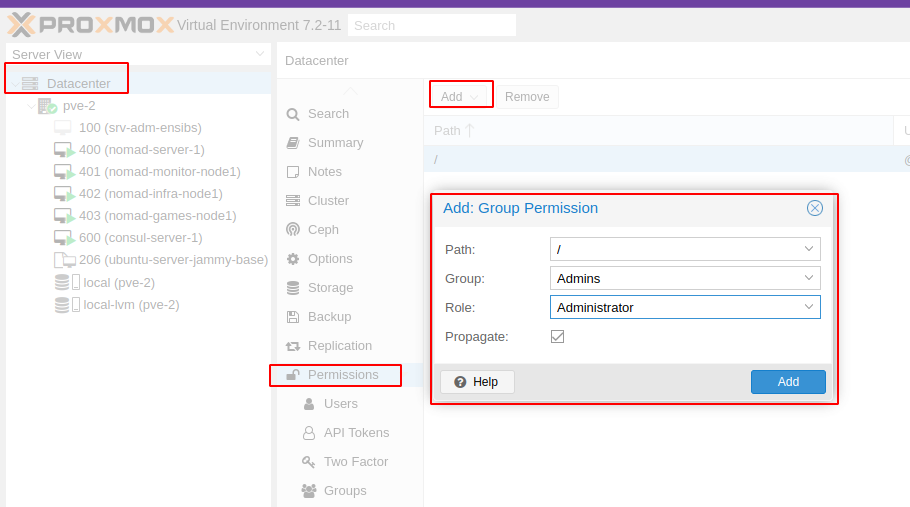
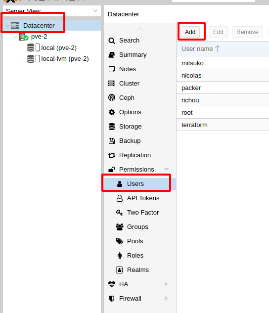
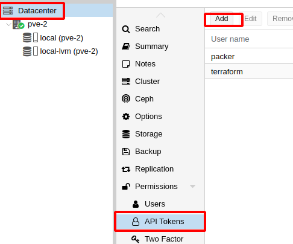
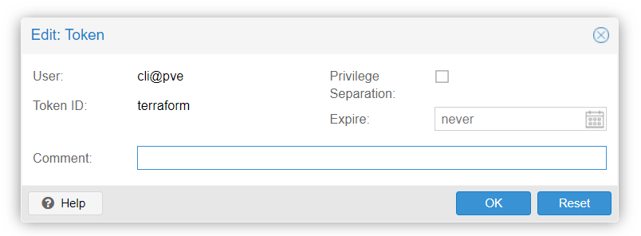
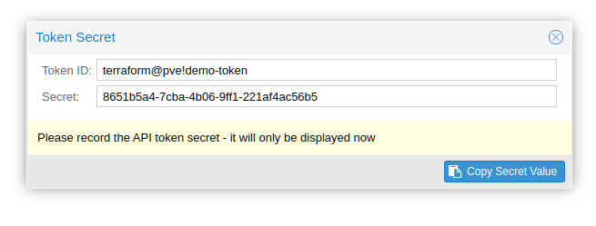
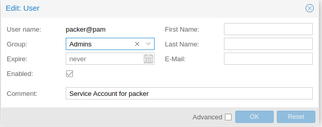
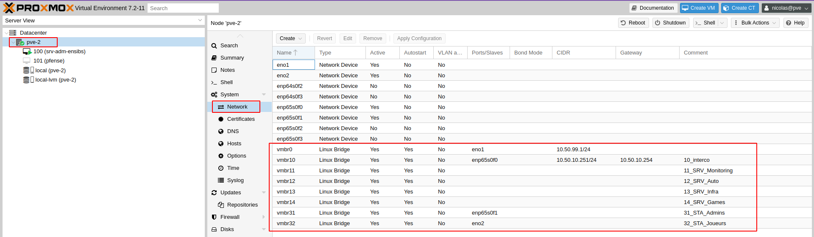
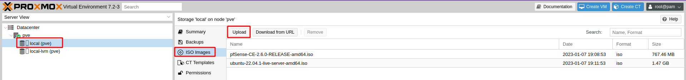

# Prérequis : installation proxmox

## Installation sur le serveur

### Créer la clé bootable

#### Télécharger l'iso depuis le site officiel Proxmox VE 

https://www.proxmox.com/en/downloads?task=callelement&format=raw&item_id=654&element=f85c494b-2b32-4109-b8c1-083cca2b7db6&method=download&args[0]=253a9bd0b304066b5d1363ba5c939b56

reférence : https://pve.proxmox.com/pve-docs/

#### Utiliser un utilitaire pour créer une clé bootable

- balena etcher (préférable) https://www.balena.io/etcher/
- rufus.exe https://rufus.ie/fr/

### Booter sur la clé USB

- brancher la clé sur un port USB du serveur

Pour un serveur **Dell** : (peut varier selon le modèle)
F11 (Enter boot menu)
 - BIOS Boot Manager
   -  Hard drive C:
   -  Front USB
Sélectionner USB DEVICE
Installer proxmox
Connexion sur l'interface d'admin, root et mot de passe donné pendant l'installation
(voir proc sur proxmox.com)

Réaliser l'installation de base avec les informations suivantes : 

| Clé | Valeur |
|---|---|
| Adresse IP | 10.50.10.251/24|
| Mot de passe root | *à vous de choisir* |
| Domaine | donk.lan  |
| Hostname |  pve |

Joindre le serveur via https://10.50.10.251:8006

### Créer le groupe d'administrateurs

    

### Ajouter les permissions au groupe d'administrateur

    

### Création des utilisateurs

    

### Créer les comptes de services terraform et packer

Voir création des utilisateurs + 

    

Décocher le `Privilege Separation`

    

    

Les ajouter dans le groupe Admins.

    

**Conserver le token id et le token secret**

### Configuration réseau

    

### Charger les ISO

 - **pfSense**, télécharger la version [pfSense-CE-2.6.0-RELEASE-amd64](https://atxfiles.netgate.com/mirror/downloads/pfSense-CE-2.6.0-RELEASE-amd64.iso.gz)
 - **Ubuntu**, télécharger la version [22.04.1](https://releases.ubuntu.com/22.04.1/ubuntu-22.04.1-live-server-amd64.iso)

    

